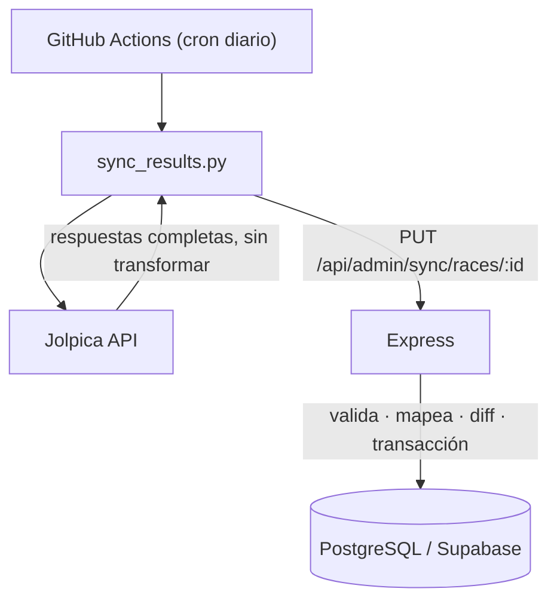

# F1 Grand Prix Hub

[](https://github.com/Lauty2005/f1-grand-prix-hub/actions/workflows/ci.yml)
[](https://github.com/Lauty2005/f1-grand-prix-hub/actions/workflows/sync-results.yml)

App full-stack para navegar información de Fórmula 1, en español (es_AR): sitio
público, sistema de artículos y panel de admin, con generación asistida por IA,
newsletter y notificaciones por mail.

Monorepo con dos paquetes independientes — **no hay `package.json` en la raíz**:

```
client/    Vite 7 multi-página, JS vanilla + SCSS   → Vercel
server/    Express 5 + pg                            → Render
f1_agent/  agente Python que publica borradores      → GitHub Actions
```

Ver [`CLAUDE.md`](CLAUDE.md) para el detalle de arquitectura, rutas y convenciones.

## Cómo funciona el sync de resultados

Cada mañana un workflow trae de la API de Jolpica los resultados, el sprint y
la clasificación de las carreras que faltan, y los escribe en la base. Durante
los 7 días posteriores a cada GP vuelve a pasar, para capturar penalizaciones.



Decisiones que vale la pena señalar:

- **Mapeo explícito, no por nombre ni por número.** `drivers.jolpica_id` y
  `races.jolpica_round` guardan la correspondencia. Hacía falta: en 2026 las
  rondas se renumeraron al cancelarse dos carreras (Mónaco es la 8 en la base y
  la 6 en Jolpica), los números de piloto cambiaron y los nombres no coinciden.
- **El cliente no transforma nada.** El script manda la respuesta cruda de
  Jolpica; el backend es la única fuente de verdad sobre las convenciones de
  datos. Así la lógica se testea sin red y no hay dos versiones de las reglas.
- **Se valida antes de escribir.** Si la temporada o la ronda de la respuesta
  no coinciden con la carrera, responde 422 y no toca la base. Una transacción
  por carrera, con la fila bloqueada.
- **`dry-run` y `force`.** El dry-run calcula el diff completo y hace rollback.
  Pisar datos que ya existen, fuera de la ventana de 7 días, exige `force`.
- **Idempotente.** El upsert lleva un guard `IS DISTINCT FROM`: volver a correr
  el sync sobre datos iguales no escribe nada.
- **Tests de paridad contra datos reales.** Los fixtures son respuestas de
  Jolpica sin editar, y se comparan contra lo que se había cargado a mano.

## Levantar el proyecto en un comando

Ver [Desarrollo local con Docker](#desarrollo-local-con-docker): un Postgres 17
con una copia de los datos deportivos y el backend apuntando a esa base.

## Desarrollo local sin Docker

```bash
cd client && npm run dev    # http://localhost:5173
cd server && npm run dev    # http://localhost:3000
```

El backend levanta contra lo que diga `DATABASE_URL` en `server/.env`
(normalmente Supabase).

## Desarrollo local con Docker

Levanta un Postgres 17 con una copia de los datos **deportivos** de producción
(sin datos personales) y el backend apuntando a esa base. Sirve para probar
migraciones y cambios de datos sin tocar Supabase.

Necesitás Docker y la connection string del **session pooler** de Supabase
(puerto 5432; el transaction pooler 6543 no sirve para `pg_dump`).

```bash
cp .env.example .env          # y completar SUPABASE_DB_URL
make snapshot                 # genera db/init/01_schema.sql y 02_seed.sql
make up                       # levanta db + api
curl localhost:3000/api/health
```

### Targets

| Comando | Qué hace |
| --- | --- |
| `make up` | `docker compose up -d --build` |
| `make down` | baja el stack, conserva el volumen |
| `make reset` | borra el volumen, recrea la base y re-ejecuta `db/init/` |
| `make snapshot` | copia las tablas deportivas de Supabase a `db/init/` |
| `make logs` | sigue los logs |
| `make psql` | abre `psql` contra la base local |
| `make test` | tests del backend (hoy no hay ninguno) |
| `make token` | firma un JWT de agente con el `JWT_SECRET` local |
| `make migrate` | aplica `db/migrations/*.sql` en orden |
| `make migrate-down M=<n>` | revierte una migración |

En Windows, `make` no viene instalado. O lo instalás
(`winget install GnuWin32.Make`, o `choco install make`), o corrés los comandos
de cada target a mano desde Git Bash — son una o dos líneas cada uno.

### Probar el sync de Jolpica en local

Los endpoints de sync viven en `/api/admin/sync` y piden un JWT de admin.
Contrato completo en [`CLAUDE.md`](CLAUDE.md).

```bash
make reset && make migrate        # base con datos + columnas de mapeo
TOKEN=$(make -s token)

# Que carreras necesitan sync
curl -s "localhost:3000/api/admin/sync/pending?season=2026" \
  -H "Authorization: Bearer $TOKEN"

# Dry-run: calcula el diff y no escribe nada. El body son las respuestas
# completas de Jolpica; sirven los fixtures de los tests.
F=server/src/services/jolpica/__fixtures__
jq -n --slurpfile r $F/2026-6-results.json --slurpfile q $F/2026-6-qualifying.json \
  '{source:"jolpica", results:$r[0], qualifying:$q[0]}' > /tmp/monaco.json

curl -s -X PUT "localhost:3000/api/admin/sync/races/44?dry_run=1" \
  -H "Authorization: Bearer $TOKEN" -H "Content-Type: application/json" \
  --data @/tmp/monaco.json
```

Sin `dry_run`, sobrescribir datos distintos fuera de la ventana de 7 dias
devuelve 409 con el diff: hace falta agregar `&force=1`.

Los tests de integracion del sync necesitan `TEST_DATABASE_URL`, que
`docker-compose.yml` ya define para el servicio `api`. Por eso `make test`
los corre y `make test-local` los saltea.

### Qué no funciona en local

El `.env` de la raíz usa valores dummy para los servicios externos, así que
estas funcionalidades quedan inactivas (el backend arranca igual):

- **Cloudflare R2** — subida de imágenes de artículos.
- **Gemini / Anthropic** — generación de artículos con IA.
- **Resend** — envío de mails del newsletter.
- **Telegram** — notificaciones del workflow.

Nada de eso hace falta para trabajar con datos deportivos.

### Detalles

- El agente Python está bajo el profile `agent`: no arranca con `make up`.
  Se corre a demanda con `docker compose run --rm agent`.
- `db/init/` solo se ejecuta cuando se crea el volumen. Después de regenerar el
  snapshot hay que hacer `make reset`, no `make up`.
- El bind mount `./server:/app` también monta `server/.env` dentro del
  contenedor. No pasa nada: `docker-compose.yml` fija `DATABASE_URL` y
  `DATABASE_SSL` en `environment:`, y `dotenv` no pisa variables que ya existen
  en `process.env`. El contenedor nunca se conecta a Supabase.
- `DATABASE_SSL=false` es la única variable nueva que lee el backend. Si no está
  definida, el comportamiento es idéntico al de antes.
